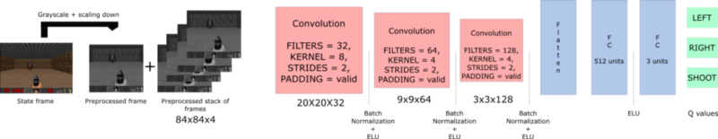

# Deep Q-learning

A neural-network takes a state and approximates Q-values for actions based on that state, instead of a Q-table.

Dropping off the Q-table because as state-space increases, Q-table becomes ineffective.

For example, a game such as Doom has millions of possible states, and Q-table usage is infeasible w.r.t. time and resources.

Use Q-tables only when action and observation spaces are of the order of magnitude of a few 1000s

This will be the architecture of our Deep Q Learning:

* Our Deep Q Neural Network takes a stack of four frames as an input. 
* These pass through its network, and output a vector of Q-values for each action possible in the given state. 
* We need to take the biggest Q-value of this vector(suppose q-vec = [1 2 3] , where respective actions are $a_1, a_2, a_3$ ; $Q_{s_t, a_1} = 1, Q_{s_t, a_2} = 2, Q_{s_t, a_3} = 3$, here it would be advisable to pick $ a_3 $, since it results with the max-q-value.) to find our best action.

# Doom 

## Pre-processing

* Pre-processing from RGB to Grayscale. This wouldn't cause any loss of information since colour is not important for killing the opponent. 
* reduce the complexity of our states to reduce the computation time needed for training.
* crop the frame, for instance the roof isn't important for the game.
* reduce the size of the frame.
* stack four sub-frames together

### Why stacking?

handle the problem of **temporal limitation**. 

Consider a frame of the game *Pong*. 1 frame can only display the state of moving-walls and moving-ball, but we also need to know their respective velocities(**speed** and **direction**), in order to determine the best action, since their velocities(**speed** and **direction**) will obviously matter in action selection. Hence we actually stack multiple-*sub-frames* into a **frame**.

## CNNs

* allow us to exploit spatial relations within an image, and since we have **stacked frames** , we can also extract spatial information across them.
* ELU(exponential linear unit) will be used for activation.
* Fully-connected with ELU activation ----> fully-connected(with linear activation)---> q-values for all actions, for the given state.