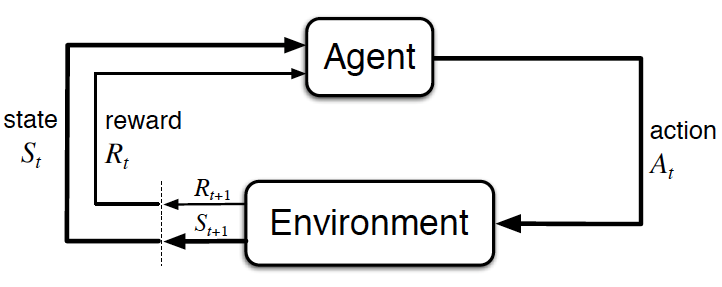

# Process

</img>

Let’s imagine an agent learning to play Super Mario Bros as a working example. The Reinforcement Learning (RL) process can be modelled as a loop that works like this:

- Our Agent receives **state S0** from the **Environment** (In our case we receive the first frame of our game (state) from Super Mario Bros (environment))
- Based on that **state S0,** agent takes an **action A0** (our agent will move right)
- Environment transitions to a **new** **state S1** (new frame)
- Environment gives some **reward R1** to the agent (not dead: +1)

This RL loop outputs a sequence of **state, action and reward.**

The goal of the agent is to maximise the expected cumulative reward.

# The central idea of the Reward Hypothesis

Maximisation of the **cumulative** reward.

cumulative reward at each time-step t : $G_t = R_{t+1} + R_{t+2} + ...$ = $\sum\limits_{k=0}^{T}{R_{t+k+1}}$

we add rewards for time-steps greater than t because, $R_t$ is the input given to an agent, and it then decides actions that lead to different values of each $R_{t+1}, R_{t+2}, ....$ out of which, given the current state we need to pick that action $A^{*}_{t}$ which will give us the maximum reward sum.

In **reality**, we can't simply add these rewards. The rewards that come sooner (in the beginning of the game) are more probable to happen[their tendency to occur is more], since they are more predictable than the long term future reward. For instance consider the following mouse cheese game:

agent=mouse, opponent=cat, Goal=eat max amount of cheese before cat eats u.

More probable to eat the cheese near mouse than the cheese close to the cat (the closer we are to the cat, the more dangerous it is).

As a consequence, the reward near the cat, even if it is bigger (more amount of cheese), will be *discounted*. We’re not really sure we’ll be able to eat it.

### Discount

discount-rate = $\gamma , 0 < \gamma < 1$  

* if $\gamma$ is large, discount is small. hence agent cares more about long-term reward
* if $\gamma$ is small, discount is large. hence agent cares more about short-term reward

$G_t = R_{t+1} + \gamma R_{t+2} + \gamma^{2} R_{t+3} + ...$ = $\sum\limits_{k=0}^{T}{\gamma^{k} R_{t+k+1}}$

As the time step increases, the cat gets closer to us, so the future reward is less and less probable to happen(lesser tendency to pick those cheese which are closed to cat, regardless of the fact that the reward is more[the amount of cheese is greater in cells nearer to the cat ]).

# Episodic/Continuing Tasks

a task is an instance(an example) of RL problem

## Episodic Tasks

we have a starting point and an ending point **(a terminal state). This creates an episode**: a list of States, Actions, Rewards, and New States. In the context of Super Mario Bros, either reaching the end of a level, or dying can be considered as the beginning of a new episode.

## Continuous Tasks

**These are tasks that continue forever (no terminal state).** In this case, the agent has to learn how to choose the best actions and simultaneously interacts with the environment.

For instance, an agent that do automated stock trading. For this task, there is no starting point and terminal state. **The agent keeps running until we decide to stop it.**

| Monte-Carlo                                                  | TD(temporal difference) learning methods |
| ------------------------------------------------------------ | ---------------------------------------- |
| Collecting the rewards **at the end of the episode** and then calculating the **maximum expected future reward** | Estimate **the rewards at each step**    |

## Monte-Carlo

rewards are received only at the end of the game. A new game is started, along with knowledge from previous game, agent makes better decision with each iteration.

$\textcolor{red}{V(S_t)} = \textcolor{blue}{V'(S_t)} + \alpha [G_t - \textcolor{blue}{V'(S_t)}]$ , where V =  maximum expected reward starting at $S_t$ in the *new episode* , V' = maximum expected reward starting at $S_t$ in the *previous episode*. $\alpha$ : learning rate, $G_t$ = **discounted** cumulative rewards.

### Steps adopted

1. always start at same starting point
2. game(*episode*) ends when either eaten by cat, or $\textrm{n}_{\textrm{steps}}$ > 20 .
3. at the end of episode, we have list of state, rewards and actions(taken at each time-step, so as to reach the end)
4. $G_t$(cumulative sum of rewards) is calculated, to assess the agent's performance.
5. using the above relation of monte-carlo, the V($S_t$) is updated
6. Since the game has currently ended(or at-least an episode has), start a new game(or new episode), with this new knowledge(new V($S_t$))

By running more and more episodes, **the agent will learn to play better and better.**

## Temporal Difference learning method

update its value estimation V($S_t$) for the non-terminal states $S_t$ occurring at that experience.(updation of max expected future reward  using reward-at-next-step, at each time-step)

| monte-carlo                                 | TD                                                           |
| ------------------------------------------- | ------------------------------------------------------------ |
| $V(S_t) = V'(S_t) + \alpha [G_t - V'(S_t)]$ | $V(S_t) = V'(S_t) + \alpha [R_{t+1}$ +  $\gamma V'(S_{t+1}) - V'(S_t)]$ |

this is called one-step TD (or TD(0) ), TD-target = $R_{t+1} + \gamma V'(S_{t+1})$ , a better way to represent TD(0) is:

$V(S_t) = (1-\alpha)V'(S_t) + \alpha[R_{t+1} + \gamma V'(S_{t+1}) ]$ , where the *TD target* term represents information from a time-step one-step ahead of the current one, and $V'(S_t)$ represents that of the current time step(from previous episode). 

When we use estimates($V'(S_t), V'(S_{t+1})$) to update estimates($V(S_t)$) we call this *bootstrapping* ( literal meaning is to help oneself, often through improvised means ).

Note: this technique has a higher bias than TD(1) or Monte-Carlo method, since it uses its old estimated max-value-reward to improve its estimates, however in TD(1) and MC, we use all estimates from an entire episode.

# Exploration/Exploitation Tradeoff

| Exploration                                     | Exploitation                                        |
| ----------------------------------------------- | --------------------------------------------------- |
| finding more information about the environment. | exploiting known information to maximize the reward |

Since we can fetch the cheese near us(points = +1), infinite number of times(actually till the game-level requirement is fulfilled) , the agent would keep on just visiting cells near the mouse. Whereas, at the top of the cell, the gigantic sum of cheese(+1000) would be completely missed. On exploring a bit further, our agent could potentially find the +1000 . This is what we call the **exploration/exploitation trade off**. We must define a rule that helps to handle this trade-off.

# Value-based approach to RL

goal is to optimize the value function *V(s)*.

$v_\pi(s) = E_\pi[R_{t+1} + \gamma R_{t+2} + \gamma^{2}R_{t+3} + .... | S_t = s]$ , where $v_\pi(s)$ = value of each state, which is actually the total amount of the reward an agent can **expect** (in other words, the *expected discounted cumulative reward*)to accumulate over the future, starting at that state. The agent will use this function to select a state at each time-step. It will take the state with the biggest value of expectation.

 The expectation value at each state is given, hence starting from the **Start**, we will select -7, -6, -5, -4, -3, -2, -1 cells, and reach the **Goal **.

# Policy Based

directly optimize the policy function *π(s)* without using a value function. a = $\pi(s)$ , where a: action, $\pi$ : policy, s: state. the agent learns a policy function, which results in a mapping between state to best-corresponding-action. 

| Deterministic policy                                         | Stochastic policy                                            |
| ------------------------------------------------------------ | ------------------------------------------------------------ |
| policy at a state will always return the same action(mapping is deterministic) | outputs a distribution probability over all actions( hence the action chosen is random, based on some varying pdf for ), $\pi(a|s) = P[A_t = a|S_t = s]$ |

the arrows tell in which direction to go. if the agent lands on cell 1, it has to move in the right direction; if it lands on cell 4, it has to move in the upward direction; if it lands on cell 6, it has to go down, and so on, till it reaches the **Goal**. Hence the policy-based RL method directly illustrates the steps to reach **Goal**, from **Start**. 

# Model Based

In model-based RL, we model the environment. This means we create a model of the behavior of the environment. Hence, there is no scope for generalisation, since the model creation steps can never be the same, and for each model we would most probably need a different model representation.

# Deep-Reinforcement Learning

This method used deep-learning(neural nets) to solve the RL problem.