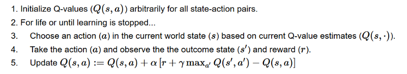

Q-learning : value-based RL algo.

## Game-rules

- You can move one tile at a time. 
- The enemy can’t, but land on the same tile as the enemy, and you will die. 
- **Your goal** is to go the castle by the fastest route possible. This can be evaluated using a *points scoring* system.
- You lose -1 at each step (losing points at each step helps our agent to be fast).
- If you touch an enemy, you lose -100 points, and the episode ends.
- If you are in the castle you win, you get +100 points.

### Sol-1

  colour the tiles as green(safe to land on) and red(danger zone, will die). Then the agent will know that between red and green tiles, always select the green tile.

The problem with this model is that between 2 green tiles, which tile to pick such that the goal is achieved cannot be solved, and the agent will remain stuck in an $\infin$ loop.

## Sol-2: Q-table

Q-table( **q = quality** of action taken) is created to view all actions and max reward for each action taken at each state is calculated. 

 

Each state (tile) allows four possible actions. These are moving left, right, up, or down. The columns will be the four actions (left, right, up, down). The rows will be the states. The value of each cell will be the maximum expected future reward for that given state and action. Q-learning algo to be used for finding the Q-function/value-function.

## Q-learning algorithm

$Q^{\pi}(s_t, a_t) = E[R_{t+1} + \gamma R_{t+2} + \gamma^{2}R_{t+3}.... | s_t, a_t]$, q-value given that state($s_t$) and given that action chosen on that state($a_t$); 	using the Q-table, this value will be the cell corresponding to Actions=$\textrm{a}_t$ and States = $\textrm{s}_t$ . The values in the Q-table will be updated based on exploration of the agent, using Bellman's equation.

it can be also written as Q(s, a) := $(1-\alpha)$Q(s, a) + $\alpha[r + \gamma max_{a'}(Q(s', a'))]$ , this is known as *Bellman equation*.

In the context of our knight-queen game, initially Q$_{n\times m}$ = 0$_{n\times m}$ . Until the knight dies, or time runs out, we would be repeating the following process:

* **choose an action a**, with input to the Q-function as state s, using the Q-table. Problem: since all Q-table cells are 0, how to update the Q-table and pick the initial value?:
  * Here, the exploration/exploitation tradeoff comes in handy.
  * We specify an exploration rate **$\epsilon$** , which we set to 1 in the beginning. This is the rate of steps that we’ll do randomly(exploring the steps is random, since action-selection is also random). In the beginning, this rate must be at its highest value, because we don’t know anything about the values in Q-table. This means we need to do a lot of exploration, by randomly choosing our actions.
  * We generate a random number. If this number > $\epsilon$, then we will do *exploitation* (this means we use what we already know to select the best action at each step, since the exploration rate is now no-longer considered to be significant for any better learning, as it is less than a randomly generated number). Else, we’ll do exploration.
  * The idea is that we must have a big $ \epsilon$ at the beginning of the training of the Q-function. Then, reduce it progressively as the agent becomes more confident at estimating Q-values.
    
* Take the action *a* and observe the outcome state *s’* and reward *r.* Now update the function Q(s,a). the max(Q'(s', a')) talks about the above.
  **Bellman Equation**  : max (Q' (s', a')) means on taking all possible actions a' on arriving at the state $s'_t$ , the maximum expected Q-value (or max expected future reward value) is to be chosen, so as to update Q(s, a).  $\gamma$ is the discount rate.

Consider the mouse-cheese-rat poison example. we have the starting cell, the +1 cell, +2 cell, +10 cell(end of episode, since we win) and rat poison(death and thus end of episode).  our initial Q-table is :

| Actions States | $ \leftarrow $ | $ \rightarrow $ | $ \uparrow $ | $ \downarrow $ |
| ------------------------------------------------------------ | --------------------------------------- | ---------------------------------------- | ------------------------------------- | --------------------------------------- |
| Start                             | 0              | 0               | 0            | 0              |
| Small cheese(+1)                  | 0              | 0               | 0            | 0              |
| 2 Small cheese(+2)                | 0              | 0               | 0            | 0              |
| No cheese(+0)                     | 0              | 0               | 0            | 0              |
| Big cheese(+10)                   | 0              | 0               | 0            | 0              |
| Death                             | 0              | 0               | 0            | 0              |

Since we don't know anything about the environment, the $\epsilon$ is set very high(close to 1). Hence we randomly choose an action, out of the 4 available ones. Let that randomly-chosen action be $\rightarrow$ .

now, the new state, s' = small cheese(+1) , according to the Bellman equation, Q = (1-$\alpha$)Q$_0$ + $\alpha$[R+$\gamma$ max (Q'(s', a') ) ], $\alpha$ = 0.1, $\gamma$ = 0.9, Q$_0$ = 0, Q' = 0, R = +1., hence the new value of Q , i.e. Q(start, $ \rightarrow $) = (1-0.1)$\times $0 + 0.1$\times$[1 + 0.9$\times$0] = 0.1 ; since $\forall a', a' \epsilon \{\rightarrow, \leftarrow, \uparrow, \downarrow \}$ Q(+1-cheese, a')[ i.e. Q'(s', a') ] = 0.

After updation, the Q-table is:

| Actions States | $ \leftarrow $ | $ \rightarrow $ | $ \uparrow $ | $ \downarrow $ |
| ------------------------------------------------------------ | --------------------------------------- | ---------------------------------------- | ------------------------------------- | --------------------------------------- |
| Start                             | 0              | 0.1            | 0            | 0              |
| Small cheese(+1)                  | 0              | 0               | 0            | 0              |
| 2 Small cheese(+2)                | 0              | 0               | 0            | 0              |
| No cheese(+0)                     | 0              | 0               | 0            | 0              |
| Big cheese(+10)                   | 0              | 0               | 0            | 0              |
| Death                             | 0              | 0               | 0            | 0              |

The process is repeated till the completion of episode(either death or +10 is hit or timeout).

Please refer to the **Taxi-v2** and **FrozenLake** examples in ../projects/ .